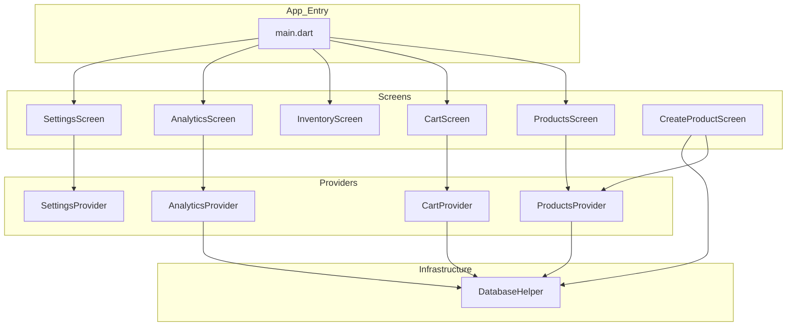

# Graphify Report: OruShops

**Extraction Mode:** Standard
**Date:** 2026-05-01 10:19:35
**Source Directory:** `.`

## Architecture Graph

## Module Breakdown

### lib/core
Contains infrastructure code including the SQLite database helper and data models.
- **Nodes:** 1
- **Primary:** `database_helper.dart`

### lib/presentation
Contains the UI layer with functional screens.
- **Nodes:** 5 primary screens.

### lib/providers
Manages global state and interaction with the database layer.
- **Nodes:** 4 primary providers.

## Statistics
- **Total Nodes:** 11
- **Total Edges:** 12
- **Inferred Edges:** 0
- **Depth:** 4 layers

